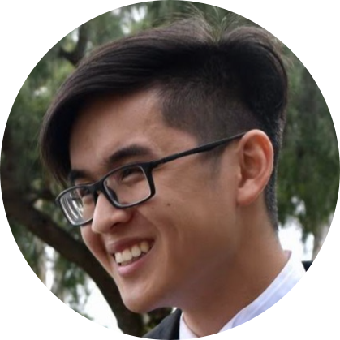

# William Chung
## Aspiring Computer Scientist



### Hi there 👋

- 🔭 I’m currently working on my studies at [**UC San Diego**](https://ucsd.edu/) as a [Computer Science](https://cse.ucsd.edu/) major and [Mathematics](https://www.math.ucsd.edu/) minor
- 🌱 I’m currently learning how to become a computer scientist
- 👯 I’m looking to collaborate on any projects working to solve real-world problems 
- 🤔 I’m looking for help to learn more, I believe everyone has something to teach me
- 💬 Ask me about philosophy 
- 📫 How to reach me:
  - Phone: 714-696-4702
  - Email: billchung6@gmail.com
  - [LinkedIn](https://www.linkedin.com/in/williamkchung/)
- 😄 Pronouns: He/Him
- ⚡ Fun fact: I also want to become a pilot

### Resume

Click [here](assets/William%20Chung%20Resume.pdf).

### Goals

- [x] Live and learn 
- [ ] Become a computer scientist
- [ ] Discover the end goal of life

### About Me

I decided to major in Computer Science because it is the field where I see the most opportunities and potential for me to make a difference. Considering the power and prevalence of computational applications today, the possibilities for beneficial change and advancement are truly limitless. I am minoring in Mathematics because, among other things, the critical-thinking skills it teaches me are invaluable (not to mention its close relation to computer science). I also find both subjects to be endlessly fascinating, and I want to one day apply the knowledge I am learning now, and which I will continue to learn, to be a computer scientist solving the problems of today and tomorrow. It is still very early on in my journey, however, so until that day comes, I will devote myself to simply doing my best. 

In the words of Seneca: 

> *The greatest obstacle to living is expectation, which depends on tomorrow and wastes today.*

Translation to code:
```
while(true) {
    myLife.liveInPresent();
}
```
